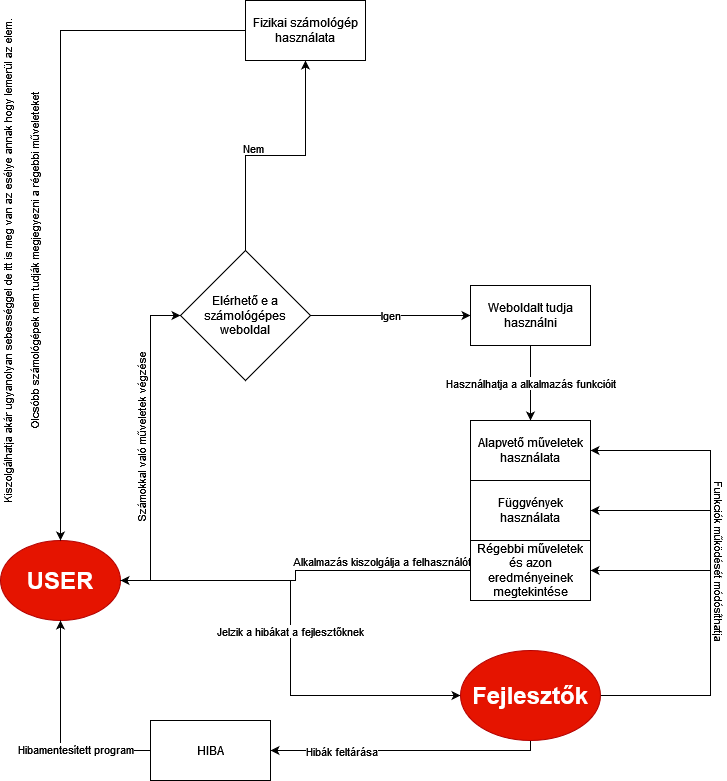

1\. Rendszer Célja
==============

Alkalmazásunk letiszult, illetve egyszerű célokkal rendelkezik.

A mindennapokban előforduló számolásokban könnyíti meg a dolgunkat.

Mi sem letisztultabb és egyszerűbb annál, hogy elindítjuk az alkalmazást és már számolhatunk is.

Annak érdekében, hogy átlátható maradjon az alkalmazás, a design-ra nagy figyelmet szentelünk. A mostanában divatos szimpla design-t fogjuk alkalmazni.

Az egyszerűség részét képezi az, hogy egy olyan számológép alkalmazást hozunk létre, melynek használatához fiókösszekapcsolás illetve regisztráció nem szükséges.

2\. Üzleti folyamatok modellje
=================

- Üzleti szereplők: USER, Fejlesztők
- Üzleti folyamatok:
-- Számítások elvégzése
-- Gombok használata (számok bevitele, műveletek)
-- Hibakezelés! USER <-> Fejlesztők

3\. Követelmények
===================

Funkcionális követelmények:
-------------------------
Az elkszítendő program egy böngészőbe futó html oldal.
Az alkalmazás lehetőséget ad arra hogy a felhasználó alapvető számokkal műveleteket tudjon végrehajtani.
Nem egész számok esetén számok pontos kiírása 5 tizedes jegyig.
Megadott művelet és annak eredményeinek tárolása
Képes legyen a felhasználó alapvető műveleteket végezni az általa megadott számokkal mint pl: + - / *
Képes legyen a felhasználó pár alapvető függvényt használni mint pl: ^ √ MOD
Képes legyen negatív számokkal is műveleteket végezni ez általi hibák lekezelése pl Gyök alatt negatív szám lekezelése
Alapvető konstant értékek tárolása: PI, Euler-féle szám

Nem funkcionális követelmények:
-------------------------
Tüneményes felhasználói felület

4\. Funkcionális terv
===================

A webalkalmazás célja, hogy a megrendelő munkafolyamatainak során felmerülő számítási problémákat már ne csak papíron tudják elvégezni, hanem a webalkalmazásunkban is.
Ennek a megoldásnak köszönhetően ezek a folyamatok gyorsabbak lesznek, illetve kevesebb lesz a hibás megoldások esélye is.

**Törekedünk az alkalmazás:**
- átláthatóságára,
- egyszerűségére,
- kényelmes használatára.

**Rendszerszereplők:**
- User
    - Számológépen gombok kattinthatósága
    - Matematikai művelet elvégzése, véglegesítése
    - Végeredmény kiírásának olvasása
    - Előzmények megtekintése, felhasználása

**Menü hierarchiák**
- Menü rendszerre nincs szükség, a webalkalmazás megnyitásakor egyből a számológép fog megjelenni.

5\. Fizikai Környzet 
===================

● Az alkalmazás webes platformra készül, főként desktopra,
de hordozható eszközökön (okostelefonok,táblagépek) is működni fog.

● Nincsenek megvásárolt komponenseink, mindent mi építünk.

● Fejlesztői eszközök:
- Visual Studio Code
- Notepad++
- Webstorm

6\. Tesztterv
==============
Még mielőtt egy alkalmazás bármilyen végfelhasználóhoz kerülhet nagyon fontos szerepet tölthet be a teszttervek.

Maga a tesztterv segítségével tudunk kritikus funckiók helyes működéséről meggyőződni ez álltal biztosítani helyes működését.

Maga a szoftver kiadása előtt 2 külön fajta tesztet szeretnénk végrehajtani ez által biztosítani azt hogy a szoftver képes legyen az elvártakra és hibamentesen fusson.

### Fejlesztői Teszt

A fejlesztői tesztet kifejezetten azok fogják végezni akik az szoftvert fejlesztették.

Ezen teszt során azt fogjuk nézni hogy az alkalmazás hogyan fog reagálni különböző böngészői környezetekben, illetve meggyőződünk arról hogy az implementált funkciók működőképesek.

### Felhasználó Teszt

A felhasználó tesztet kifejezetten a fejlesztő csapatton kívül eső emberek fogják végezni.

Ennek a tesztnek a célja, hogy a fejlesztők visszajelzést kapjanak a felhasználóktól, hogy az alkalmazás működéséről pontos információt kapjanak.

Ha bármilyen hibába fut a felhasználó, akkor egy tesztelési naplóban leírnak minden fontosabb információt a hibával kapcsolatban és továbbítják a fejlesztők felé. Ha a probléma egyértelműen javítható akkor a fejlesztők egyszerűen kijavítják, viszont ha valami komplexebb gond van akkor a fejlesztők kapcsolatba lépnek a felhasználóval hogy szűkíteni tudják a problémát és végül ki tudják javítani.

#### Tesztelésre használt eszközök

Böngészők:

-   Google Chrome 105.0.5195.127 stabil asztali verzió
-   Mozilla Firefox 104.0.2 stabil asztali verzió
  
Operációs rendszer:

-   Windows 10 21H2 stabil

7\. Implementációs terv
===================

A rendszer egyetlen **HTML** oldalból áll, ehhez a szükséges funkcionalitást **Javascript** biztosítja majd.
Az odlal megjelenése és elrendezése egy **CSS** stíluslappal történik.
Ezeket a technológiákat amennyire csak lehet külön fájlokba írva készítjük, és
úgy fogjuk egymáshoz csatolni a jobb átláthatóság, könnyebb változtathatóság,
és könnyebb bővítés érdekében.

### Általános megjelenés

Mivel a megrendelőnek fontos az, hogy a számológép reszponzív legyen, ahol csak lehet **Bootstrap**et használunk
az egyszerű CSS stíluslapokban megvalósítás érdekében. 

### Számológép számítási előzmények

Az előzmény gombra kattintva több element jelenik meg a számológép mellett egymás alatt,
amelyek az eddigi számításokat tartalmazzák.
A megvalósításhoz egy sor adatszerkezet megfelelő lesz. Ha a felhasználó egy új műveletet végez,
akkor az előzmények tetejére kerül. Ha már több mint 15 előzmény van,
akkor a legrégebbi előzmények törlésre kerülnek.

### Bemenet kezelése

A bemenet 

### Teljes bemenet törlése

A C gombra kattintva az eddig beírt teljes művelet törölni kell.

### Jelenlegi bemenet törlése

A CE gombra kattintva az jelenlegi művelet törölni kell.

### Egyetlen karakter törlése

A DEL gombra kattintva ez eddig beírt műveletből egyetlen karaktert kell törölni.

8\. Telepítési terv
===================

A szoftver webes felületéhez csak egy ajánlott böngésző telepítése szükséges (Google Chrome, Firefox, Opera, Safari, Microsoft Edge), külön szoftver nem kell hozzá.

A webszerverre közvetlenül az internetről kapcsolódnak rá a kliensek.

9\. Absztrakt Domain Modell
===================

